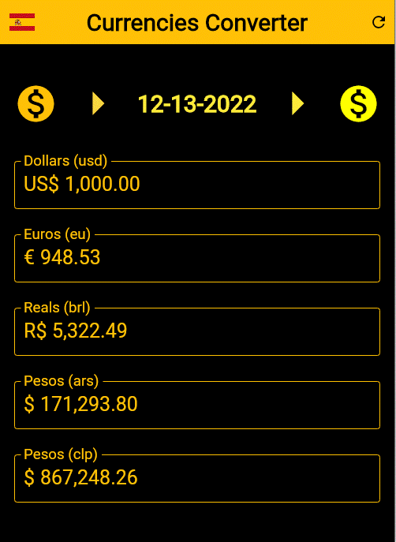

# **A Flutter Currencies Conveter App**

# About
> Currencies converter app converts Dollars, Euros, Reals (brl: Brazil), Pesos (ars: Argentina) and Pesos(clp: Chile) one each others.
>
> [Based on Daniel Ciolfi's udemy course](https://www.udemy.com/share/101Wim3@bL2WBnXJOyqEFUkkRTTFBdyhqzpZ32Q6N7CTpyPFdVlf_9YG0WhJUuuvZelTMLrW/)
>
>  

# Features
> - Convert Dollars, Euros, Reals (brl: Brazil), Pesos (ars: Argentina) and Pesos(clp: Chile) one each others.
> - Set language to English or Portuguese or Spanish. (press flag-button)
> - Currencies and dates are formatted according to the language setting.
> - Currency values are updated according to an API. (see technologies below)
> - Fill in any currency field and the others are updated.

# Layouts
>
> ## The start page for English users
> 

> ## The start page for Spanish user
> 

> ## The start page for Portugues user
> 

> ## Insert a fix value in any field
> You can insert a fix value in any field and the other fields are converted automatically, in this next example we insert one thousand dollars:  
> (for English user, we can notice the appropriate currency and date formats)
> 

> ## Insert a fix value in any field
> An example setting the language to Spanish and entering one thousand Argentine pesos:  
> (for Spanish user, we can notice the appropriate currency and date formats)
> 

> ## Insert a fix value in any field
> And, finally, an example for Portuguese user converting one thousand reals to the other currencies:  
> (we can notice the appropriate currency and date formats)
>   

# Tecnologies
> - Dart Language
> - Flutter Framework
> - I10n package
> - intl package
> - The app use an open source public api, https://github.com/fawazahmed0/currency-api

# Kick off
> - Compile to android or ios or web or windows.
> - Install and run.

# Pro version
> - Set and convert over a hundred currencies dynamically.
> - Define many more APIs and compare the values of each other.
> - Generated reports to any date.
> - Save all data in a db and excel.

# Author
> Pedro Vitor Abreu
>
> <soft.pva@gmail.com>
>
> <https://github.com/softpva>

