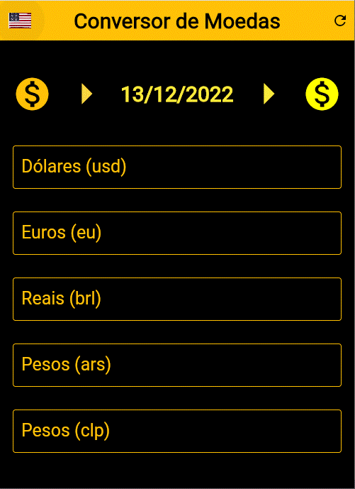
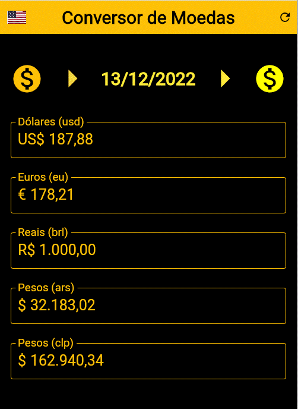

# A Flutter Currencies Conveter App.

Currencies converter app converts dollar, Euros, Reals (brl: Brazil), Pesos (ars: Argentina) and Pesos(clp: Chile) one each others.

## Features:

This simple project was written in flutter using l10n library to set user language to English, Spanish or Portuguese. The user can set a language by pressing the flag button on top-left in app bar, the language sets other features in app, like date format, currency format, etc.

The app use an open source public api, https://github.com/fawazahmed0/currency-api,  to load its current data values.

The start page for English user:

The start page for Spanish user:

The start page for Portugues user:

You can insert a fix value in any field and the other fields are converted automatically, in this next example we insert one thousand dollars: (for English user, we can notice the appropriate currency and date formats)

An example setting the language to Spanish and entering $1000 Argentine pesos: (for Spanish user, we can notice the appropriate currency and date formats)

And, finally, an example for Portuguese user converting one thousand reals to the other currencies: (we can notice the appropriate currency and date formats)

  

&nbsp;&nbsp;

[Based on Daniel Ciolfi's udemy course](https://www.udemy.com/share/101Wim3@bL2WBnXJOyqEFUkkRTTFBdyhqzpZ32Q6N7CTpyPFdVlf_9YG0WhJUuuvZelTMLrW/)

The pro version can convert over a hundred currencies dynamically and can define many more APIs and compare the values of each other.

