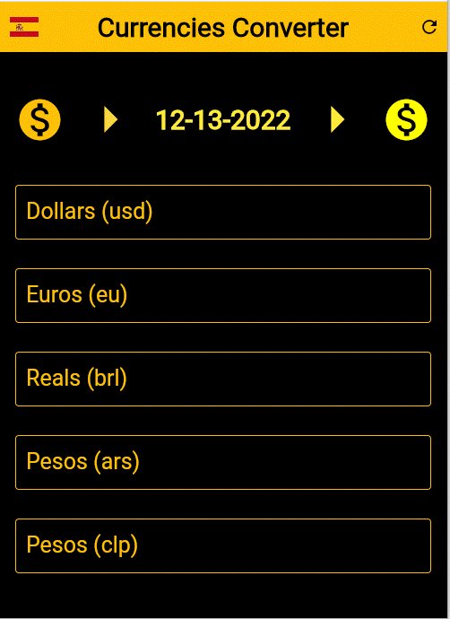
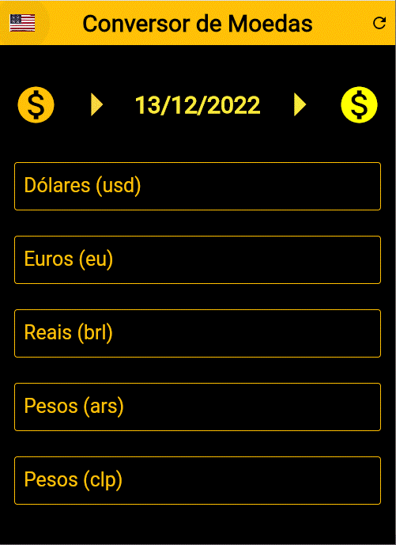
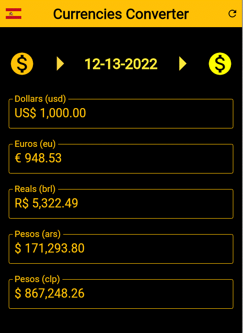
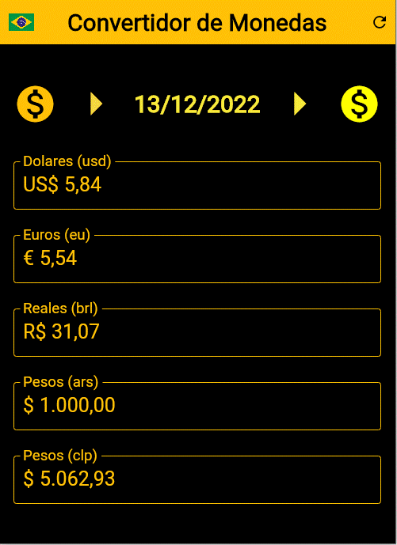
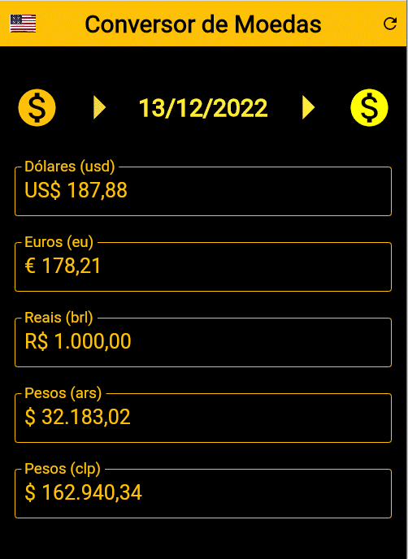

# **Um App de conversão de moedas em Flutter**

# Sobre
> Este aplicativo converte entre si Dollars, Euros, Reais (brl: Brazil), Pesos (ars: Argentina) and Pesos(clp: Chile).
>
> [Baseado no curso de Daniel Ciolfi na Udemy](https://www.udemy.com/share/101Wim3@bL2WBnXJOyqEFUkkRTTFBdyhqzpZ32Q6N7CTpyPFdVlf_9YG0WhJUuuvZelTMLrW/)
>
>  

# Aspectos
> - Converte entre si Dollars, Euros, Reais (brl: Brasil), Pesos (ars: Argentina) and Pesos(clp: Chile).
> - Selecione a língua para o inglês ou português ou espanhol. (pressione a bandeira desejada)
> - Os formatos de datas e das moedas são formatados conforme a língua em curso.
> - Os valores das moedas são atualizados via uma api. (veja tecnologias, abaixo)
> - Preencha um dos campos e os demais serão atualizados.

# Layouts
>
> ## Página inicial em inglês.
> 

> ## Página inicial em espanhol.
> 

> ## Página inicial em português.
> 

> ## Insira um valor em qualquer dos campos.
> Você pode inserir um valor em qualquer dos campos de moedas e os demais serão convertidos automaticamente.
> Neste exemplo inserimos mil dólares.
> (Em inglês, note a correta formatação da data e das moedas)
> 

> ## Insira um valor em qualquer dos campos.
> Neste exemplo configuramos a língua para espanhos e inserimos mil pesos argentinos.
> (note a correta formatação da data e das moedas)
> 

> ## Insira um valor em qualquer dos campos.
> Finalmente, um exemplo em português onde inserimos mil reais.
> (note a correta formatação da data e das moedas)
>   

# Tecnologias
> - Dart Language
> - Flutter Framework
> - I10n package
> - intl package
> - Utilizamos a api pública e open source: https://github.com/fawazahmed0/currency-api

# Rodando o App
> - Compile to android or ios or web or windows.
> - Install and run.

# Versão Pró
> - Configure e converta dinamicamente para uma centena de moedas.
> - Defina outras APIs e compare os valores entre elas.
> - Gere relatórios para qualquer data.
> - Salve todos os dados em um bd/excel.

# Autor
> Pedro Vitor Abreu
>
> <soft.pva@gmail.com>
>
> <https://github.com/softpva>

